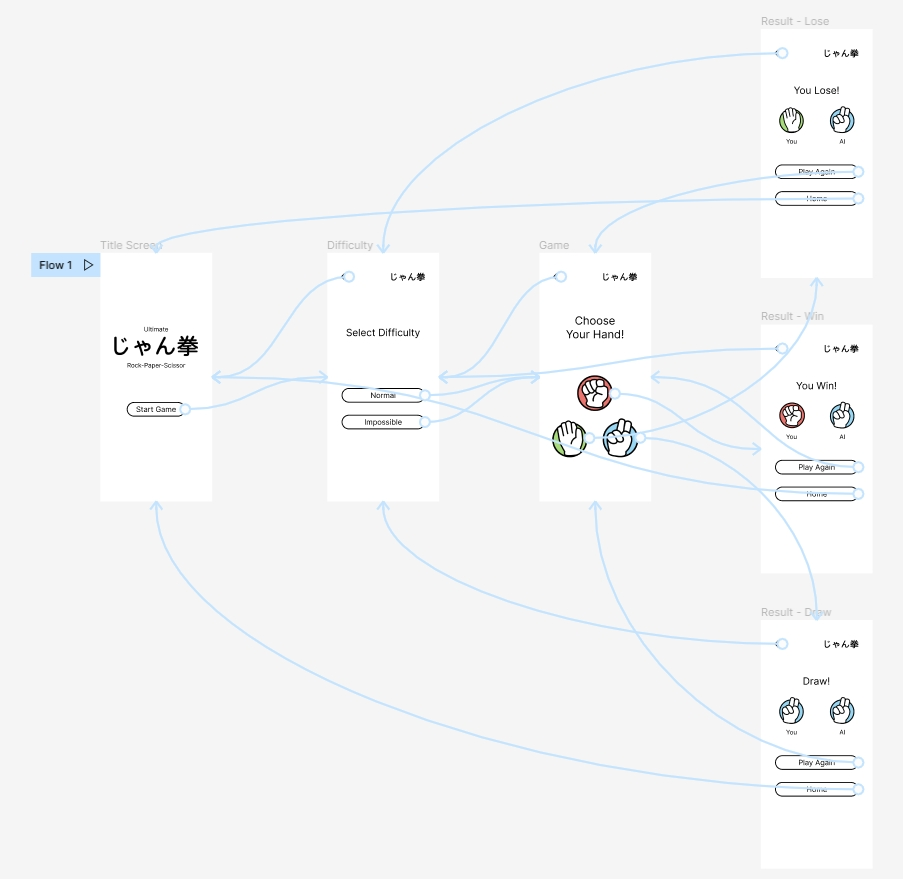
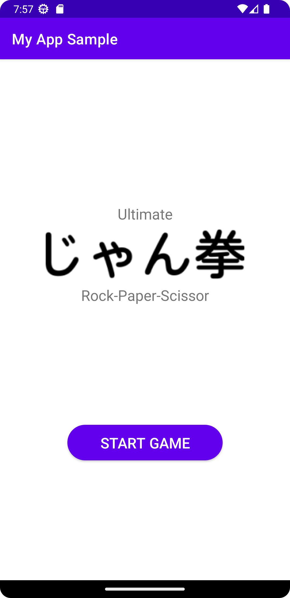

Ultimate Rock-Paper Scissor Sample
==============================================

### Overview

This is an Android game sample of a PvE (Player vs Environment) version of the traditional Rock-Paper-Scissor game.

The rules are the same as the traditional Rock-Paper-Scissor game.
 * Rock beats scissor
 * Paper beats rock
 * Scissor beats paper

### Features

This sample showcases the following features of the Android Components:

 * Navigating via actions
 * Transitions
 * Popping destinations from the back stack
 * Fragments communications via companion object

There are 2 available difficulties in this sample:
 * **Normal**. The enemy will choose random hand.
 * **Impossible**. The enemy will *always* choose the winning hand against yours.

### Screenshots
Here is the prototyping stage.

And here is the development & debuging stage.

### Others

This sample is a modification of [Navigation Basic Sample](https://github.com/android/architecture-components-samples/tree/main/NavigationBasicSample)
from [Android Architecture Components Samples](https://github.com/android/architecture-components-samples)

This sample is created as part of Mobile Application Development project, Information Technology, Universitas Gadjah Mada, 2022.
